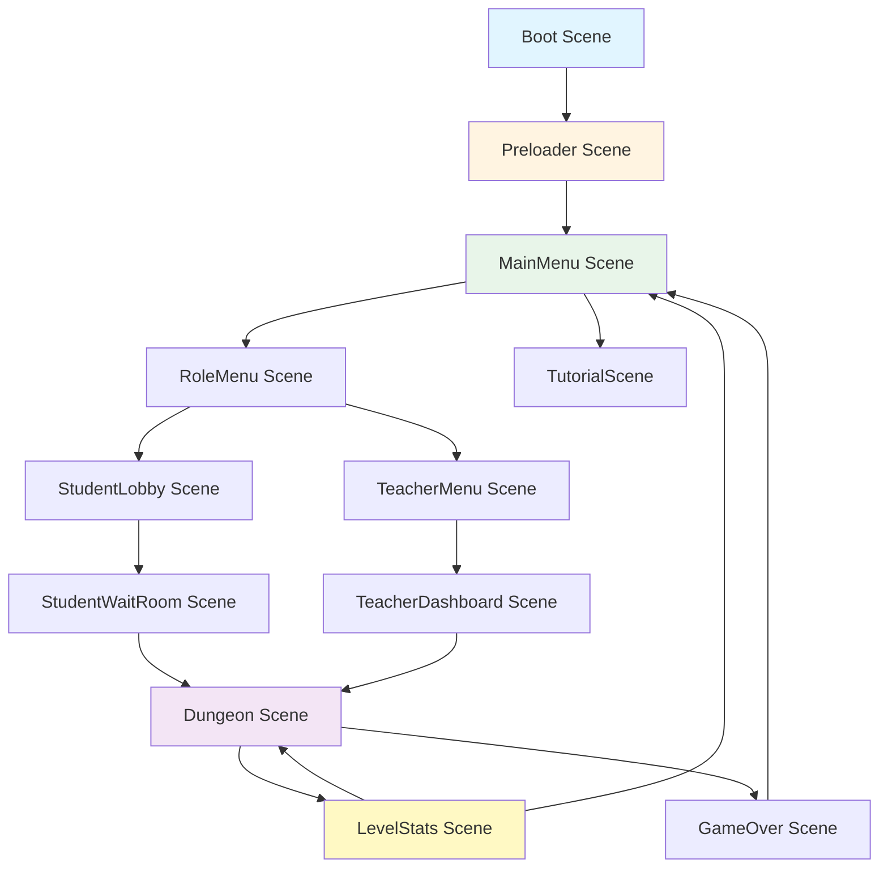
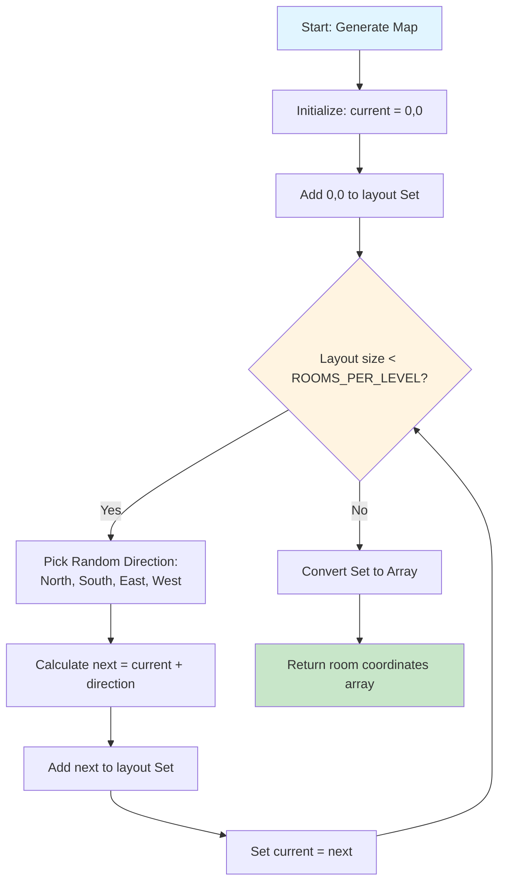
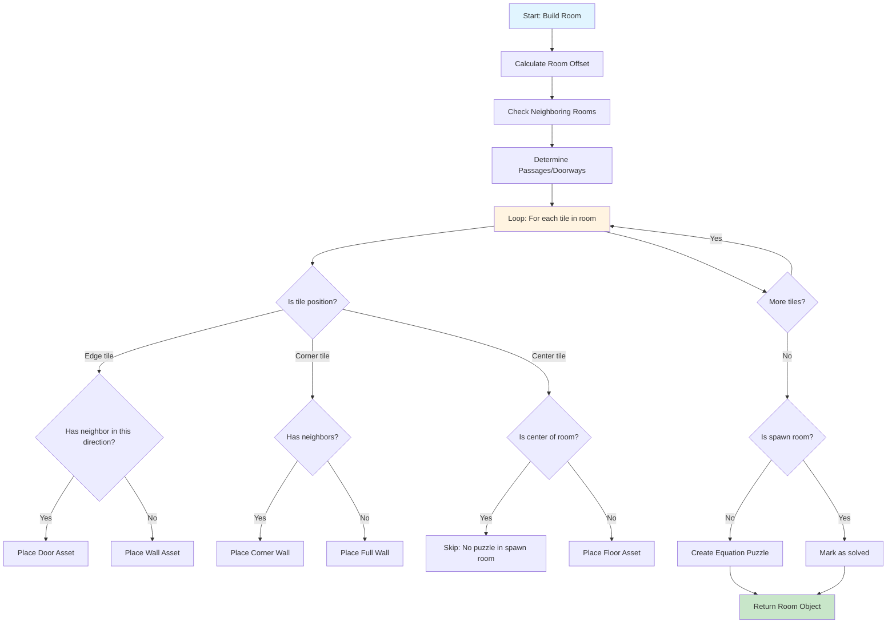
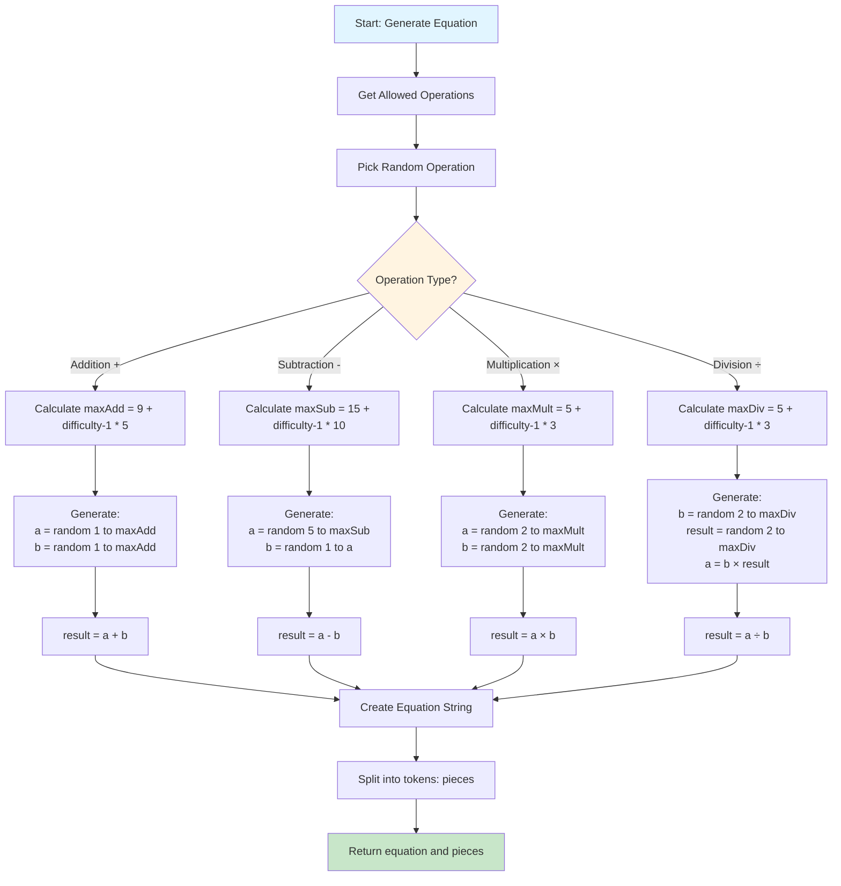
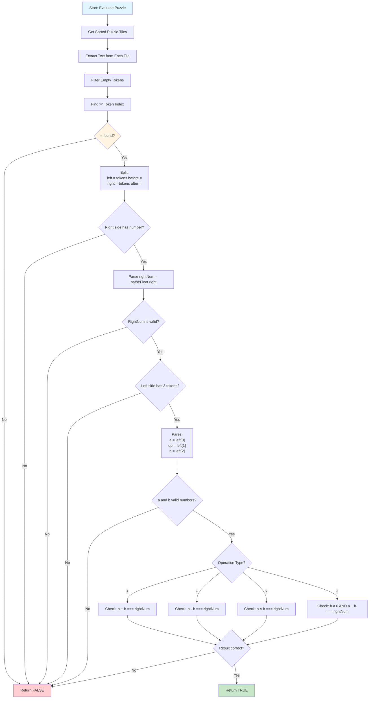
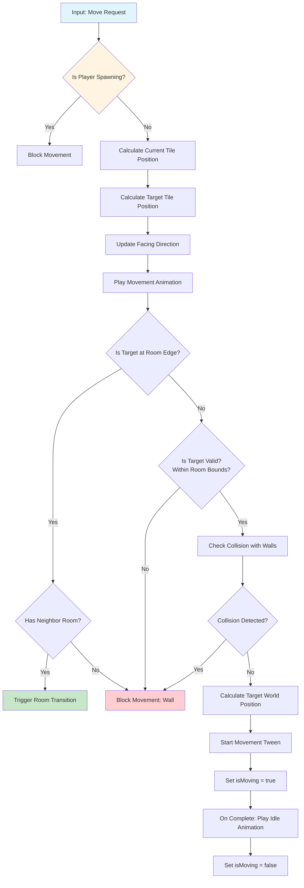
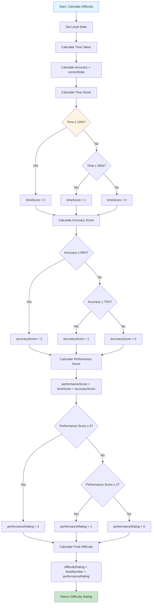
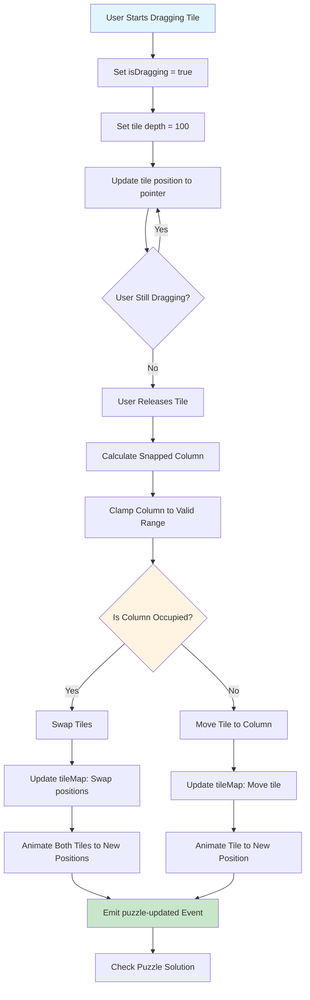
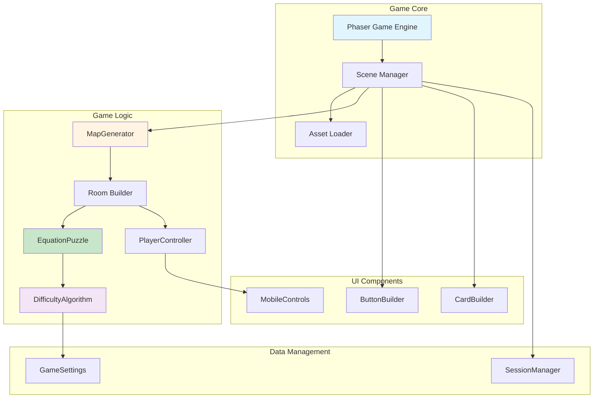

# Math Dungeon - Algorithm Design Documentation

This document provides a comprehensive overview of the core algorithms used in the Math Dungeon game, with visual diagrams for easy understanding.

---

## Table of Contents

1. [Game Flow & State Management](#1-game-flow--state-management)
2. [Map Generation Algorithm](#2-map-generation-algorithm)
3. [Room Building Algorithm](#3-room-building-algorithm)
4. [Puzzle Generation Algorithm](#4-puzzle-generation-algorithm)
5. [Puzzle Evaluation Algorithm](#5-puzzle-evaluation-algorithm)
6. [Player Movement & Collision Detection](#6-player-movement--collision-detection)
7. [Difficulty Adjustment Algorithm](#7-difficulty-adjustment-algorithm)
8. [Tile Drag & Drop Algorithm](#8-tile-drag--drop-algorithm)

---

## 1. Game Flow & State Management

### Overview
The game uses a scene-based architecture where each scene represents a different game state. Transitions between scenes are managed by Phaser's scene system.

### State Flow Diagram



### Algorithm Pseudocode

```
ALGORITHM GameFlow
BEGIN
    Initialize Phaser Game
    Load Boot Scene
    Load Preloader Scene
    Load Assets
    Start MainMenu Scene
    
    WHILE game is running DO
        IF user selects "Start Game" THEN
            Switch to RoleMenu Scene
        ELSE IF user selects "Tutorial" THEN
            Switch to TutorialScene
        END IF
        
        IF user selects role THEN
            IF role = "Teacher" THEN
                Switch to TeacherMenu Scene
                Generate Session Code
                Switch to TeacherDashboard Scene
            ELSE IF role = "Student" THEN
                Switch to StudentLobby Scene
                Enter Session Code
                Switch to StudentWaitRoom Scene
            END IF
        END IF
        
        IF session ready THEN
            Switch to Dungeon Scene
            Initialize Level
            WHILE level not complete DO
                Process Player Input
                Update Game State
                Check Puzzle Solutions
            END WHILE
            Switch to LevelStats Scene
        END IF
    END WHILE
END
```

---

## 2. Map Generation Algorithm

### Overview
Generates a random dungeon layout by creating a connected path of rooms. Uses a random walk algorithm to ensure all rooms are reachable.

### Visual Flow Diagram



### Algorithm Details

**Input:** `ROOMS_PER_LEVEL` (number of rooms to generate)

**Output:** Array of room coordinates `[{x, y}, ...]`

**Steps:**
1. Initialize a `Set` to store unique room coordinates
2. Start at origin `(0, 0)` and add it to the set
3. While set size < `ROOMS_PER_LEVEL`:
   - Pick a random direction (North, South, East, West)
   - Calculate next position: `next = current + direction`
   - Add next position to set (Set automatically handles duplicates)
   - Update current position to next
4. Convert Set to Array of coordinate objects
5. Return the array

**Time Complexity:** O(n) where n = ROOMS_PER_LEVEL  
**Space Complexity:** O(n)

### Code Reference
```javascript
// src/game/dungeon/MapGenerator.js
generateLayout() {
  const ROOMS_PER_LEVEL = GameSettings.getRoomsPerLevel();
  const layout = new Set();
  let current = { x: 0, y: 0 };
  layout.add('0,0');

  while (layout.size < ROOMS_PER_LEVEL) {
    const dir = Phaser.Math.RND.pick([
      { x: 1, y: 0 },   // East
      { x: -1, y: 0 },  // West
      { x: 0, y: 1 },   // South
      { x: 0, y: -1 }   // North
    ]);
    const next = { x: current.x + dir.x, y: current.y + dir.y };
    layout.add(`${next.x},${next.y}`);
    current = next;
  }

  return Array.from(layout).map(str => {
    const [x, y] = str.split(',').map(Number);
    return { x, y };
  });
}
```

---

## 3. Room Building Algorithm

### Overview
Builds individual rooms by placing floors, walls, doors, and puzzles based on room position and neighboring rooms.

### Visual Flow Diagram



### Algorithm Details

**Input:** 
- `rx, ry`: Room coordinates
- `mapLayout`: Array of all room coordinates
- `wallsGroup`: Phaser group for collision

**Output:** Built Room object with floors, walls, doors, and puzzle

**Steps:**
1. Calculate room offset: `offsetX = rx * ROOM_SIZE * TILE_SIZE`
2. Check neighbors in 4 directions (top, bottom, left, right)
3. For each tile position (row, col) in room:
   - If edge tile and has neighbor: Place door asset (non-collidable)
   - If edge tile and no neighbor: Place wall asset (collidable)
   - If corner tile: Place appropriate corner wall asset
   - If center tile: Place floor asset
4. If not spawn room (0,0): Create equation puzzle
5. Return room object

**Key Logic:**
- Doors are placed at room edges where neighbors exist
- Walls block movement where no neighbors exist
- Puzzle tiles are placed in center row, shuffled

### Code Reference
```javascript
// src/game/dungeon/Room.js
build() {
  const offsetX = this.rx * ROOM_SIZE * TILE_SIZE;
  const offsetY = this.ry * ROOM_SIZE * TILE_SIZE;

  // Check neighbors
  const neighbors = [
    { x: this.rx, y: this.ry - 1, direction: 'top' },
    { x: this.rx, y: this.ry + 1, direction: 'bottom' },
    { x: this.rx - 1, y: this.ry, direction: 'left' },
    { x: this.rx + 1, y: this.ry, direction: 'right' }
  ];
  
  // Determine passages
  const passages = {};
  neighbors.forEach(n => {
    if (this.mapLayout.find(r => r.x === n.x && r.y === n.y)) {
      passages[n.direction] = true;
    }
  });

  // Build room tile by tile
  for (let row = 0; row < ROOM_SIZE; row++) {
    for (let col = 0; col < ROOM_SIZE; col++) {
      // Place appropriate asset based on position and neighbors
      // ... (wall/door/floor placement logic)
    }
  }

  // Create puzzle if not spawn room
  if (!(this.rx === 0 && this.ry === 0)) {
    this.equationPuzzle = new EquationPuzzle(...);
  }
}
```

---

## 4. Puzzle Generation Algorithm

### Overview
Generates random math equations based on selected operations and current difficulty level. Equations scale in complexity as difficulty increases.

### Visual Flow Diagram



### Algorithm Details

**Input:**
- `allowedOperations`: Array of allowed operations (['+', '-', '×', '÷'])
- `difficultyRating`: Current difficulty level (1, 2, 3, ...)

**Output:** 
- `equation`: String representation (e.g., "3 + 2 = 5")
- `pieces`: Array of tokens (e.g., ["3", "+", "2", "=", "5"])

**Difficulty Scaling:**
- **Addition:** `maxAdd = 9 + (difficulty - 1) * 5`
  - Level 1: 1-9, Level 2: 1-14, Level 3: 1-19, etc.
- **Subtraction:** `maxSub = 15 + (difficulty - 1) * 10`
  - Level 1: 5-15, Level 2: 5-25, Level 3: 5-35, etc.
- **Multiplication:** `maxMult = 5 + (difficulty - 1) * 3`
  - Level 1: 2-5, Level 2: 2-8, Level 3: 2-11, etc.
- **Division:** `maxDiv = 5 + (difficulty - 1) * 3`
  - Ensures clean division (no remainders)

**Time Complexity:** O(1)  
**Space Complexity:** O(1)

### Code Reference
```javascript
// src/game/dungeon/EquationPuzzle.js
#generateEquation() {
  const allowed = GameSettings.getAllowed();
  const pool = allowed.length ? allowed : ['+', '-', '×', '÷'];
  const op = Phaser.Utils.Array.GetRandom(pool);
  const difficultyRating = this.scene.difficultyRating || 1;
  
  let a, b, result, eq;
  switch (op) {
    case '+':
      const maxAdd = 9 + (difficultyRating - 1) * 5;
      a = Phaser.Math.Between(1, maxAdd);
      b = Phaser.Math.Between(1, maxAdd);
      result = a + b;
      eq = `${a} + ${b} = ${result}`;
      break;
    // ... other operations
  }
  return { equation: eq, pieces: eq.split(' ') };
}
```

---

## 5. Puzzle Evaluation Algorithm

### Overview
Validates whether the current arrangement of puzzle tiles forms a mathematically correct equation.

### Visual Flow Diagram



### Algorithm Details

**Input:** Array of tokens (strings) from puzzle tiles in order

**Output:** Boolean (true if equation is correct, false otherwise)

**Steps:**
1. Find the '=' token index
2. Split tokens into left side (before '=') and right side (after '=')
3. Validate right side: Must have at least 1 token, must be a valid number
4. Validate left side: Must have exactly 3 tokens [number, operator, number]
5. Parse left side: `a = parseFloat(left[0])`, `op = left[1]`, `b = parseFloat(left[2])`
6. Validate numbers: Both a and b must be valid numbers
7. Evaluate based on operation:
   - `+`: Check if `a + b === rightNum`
   - `-`: Check if `a - b === rightNum`
   - `×`: Check if `a * b === rightNum`
   - `÷`: Check if `b !== 0` and `a / b === rightNum`
8. Return true if correct, false otherwise

**Time Complexity:** O(n) where n = number of tokens  
**Space Complexity:** O(n)

### Code Reference
```javascript
// src/game/dungeon/EquationPuzzle.js
static evaluateTokens(tokens) {
  const eqIndex = tokens.indexOf('=');
  if (eqIndex === -1) return false;

  const left = tokens.slice(0, eqIndex);
  const right = tokens.slice(eqIndex + 1);
  if (right.length < 1) return false;

  const rightNum = parseFloat(right.join(' '));
  if (Number.isNaN(rightNum)) return false;

  if (left.length !== 3) return false;
  const a = parseFloat(left[0]);
  const op = left[1];
  const b = parseFloat(left[2]);
  if (Number.isNaN(a) || Number.isNaN(b)) return false;

  if (op === '+' || op === 'plus') return (a + b) === rightNum;
  if (op === '-') return (a - b) === rightNum;
  if (op === '×' || op === 'x' || op === '*') return (a * b) === rightNum;
  if (op === '÷' || op === '/') return (b !== 0) && (a / b === rightNum);

  return false;
}
```

---

## 6. Player Movement & Collision Detection

### Overview
Handles player movement input, collision detection with walls, room transitions, and animation state management.

### Visual Flow Diagram



### Algorithm Details

**Input:**
- `dx, dy`: Movement direction (-1, 0, or 1)
- `currentRoom`: Current room object
- `rooms`: Map of all rooms

**Output:** Player position updated, or movement blocked

**Steps:**
1. **Pre-movement Checks:**
   - If `isSpawning`: Block movement
   - If `isMoving`: Block movement (already in motion)

2. **Calculate Positions:**
   - `localCol = round((player.x - roomOffset) / TILE_SIZE)`
   - `localRow = round((player.y - roomOffset) / TILE_SIZE)`
   - `targetCol = localCol + dx`
   - `targetRow = localRow + dy`

3. **Update Animation:**
   - If `dx < 0`: Play 'move-left', set facing = 'left'
   - If `dx > 0`: Play 'move-right', set facing = 'right'
   - If `dy < 0`: Play 'move-up-left' or 'move-up-right' (based on last horizontal)
   - If `dy > 0`: Play 'move-down-left' or 'move-down-right' (based on last horizontal)

4. **Room Transition Check:**
   - If target is at room edge (row=0, col=center) and has top neighbor: Enter room
   - Similar checks for bottom, left, right edges

5. **Boundary Check:**
   - If target outside room bounds (0 < col < ROOM_SIZE-1, 0 < row < ROOM_SIZE-1): Block

6. **Collision Check:**
   - Phaser Arcade Physics automatically handles wall collisions
   - If collision: Block movement

7. **Execute Movement:**
   - Calculate world coordinates: `x = roomOffset + targetCol * TILE_SIZE + TILE_SIZE/2`
   - Start tween to target position
   - On complete: Play idle animation

**Time Complexity:** O(1)  
**Space Complexity:** O(1)

### Code Reference
```javascript
// src/game/dungeon/PlayerController.js
tryMove(dx, dy, allowPassages, currentRoom, rooms, onEnterRoom, onMoveComplete) {
  if (this.isSpawning) return;
  
  const rx = currentRoom.x;
  const ry = currentRoom.y;
  const localCol = Math.round((this.scene.player.x - rx * ROOM_SIZE * TILE_SIZE - TILE_SIZE / 2) / TILE_SIZE);
  const localRow = Math.round((this.scene.player.y - ry * ROOM_SIZE * TILE_SIZE - TILE_SIZE / 2) / TILE_SIZE);
  const targetCol = localCol + dx;
  const targetRow = localRow + dy;
  const center = Math.floor(ROOM_SIZE / 2);

  // Update animation based on direction
  if (dx < 0) {
    this.facingDirection = 'left';
    this.scene.player.play('move-left', true);
  }
  // ... other directions

  // Check room transitions
  if (allowPassages) {
    if (targetRow === 0 && targetCol === center) {
      if (hasNeighbor(0, -1)) return onEnterRoom(0, -1, center, ROOM_SIZE - 2);
      return; // blocked
    }
    // ... other edges
  }

  // Check bounds
  if (targetCol <= 0 || targetRow <= 0 || targetCol >= ROOM_SIZE - 1 || targetRow >= ROOM_SIZE - 1) return;

  // Move player
  const { x, y } = this.getTileCenter(rx, ry, targetCol, targetRow);
  this.movePlayer(x, y, onMoveComplete);
}
```

---

## 7. Difficulty Adjustment Algorithm

### Overview
Dynamically adjusts game difficulty based on player performance (time taken and accuracy). Uses a scoring system to determine difficulty rating.

### Visual Flow Diagram



### Algorithm Details

**Input:**
- `levelNumber`: Current level (1, 2, 3, ...)
- `startTime`: Timestamp when level started
- `correctAnswers`: Number of correct puzzle solutions
- `totalQuestions`: Total number of puzzles attempted

**Output:** `difficultyRating` (integer, typically 1-5)

**Scoring System:**

1. **Time Score:**
   - ≤ 120 seconds: `timeScore = 2`
   - ≤ 300 seconds: `timeScore = 1`
   - > 300 seconds: `timeScore = 0`

2. **Accuracy Score:**
   - ≥ 90%: `accuracyScore = 2`
   - ≥ 75%: `accuracyScore = 1`
   - < 75%: `accuracyScore = 0`

3. **Performance Score:**
   - `performanceScore = timeScore + accuracyScore` (0-4)

4. **Performance Rating:**
   - `performanceScore ≥ 4`: `performanceRating = 2`
   - `performanceScore ≥ 2`: `performanceRating = 1`
   - `performanceScore < 2`: `performanceRating = 0`

5. **Final Difficulty:**
   - `difficultyRating = levelNumber + performanceRating`

**Example:**
- Level 1, 100s, 95% accuracy → timeScore=2, accuracyScore=2 → performanceScore=4 → performanceRating=2 → difficultyRating=3
- Level 2, 250s, 80% accuracy → timeScore=1, accuracyScore=1 → performanceScore=2 → performanceRating=1 → difficultyRating=3
- Level 1, 400s, 60% accuracy → timeScore=0, accuracyScore=0 → performanceScore=0 → performanceRating=0 → difficultyRating=1

**Time Complexity:** O(1)  
**Space Complexity:** O(1)

### Code Reference
```javascript
// src/game/dungeon/DifficultyAlgorithm.js
calculatePerformance() {
  const timeTaken = (Date.now() - this.startTime) / 1000;
  const accuracy = this.totalQuestions > 0 ? this.correctAnswers / this.totalQuestions : 0;

  // Time score
  let timeScore = 0;
  if (timeTaken <= 120) timeScore = 2;
  else if (timeTaken <= 300) timeScore = 1;

  // Accuracy score
  let accuracyScore = 0;
  if (accuracy >= 0.9) accuracyScore = 2;
  else if (accuracy >= 0.75) accuracyScore = 1;

  // Performance score
  const performanceScore = timeScore + accuracyScore;

  // Performance rating
  let performanceRating = 0;
  if (performanceScore >= 4) performanceRating = 2;
  else if (performanceScore >= 2) performanceRating = 1;

  // Final difficulty
  const baseDifficulty = this.levelNumber;
  const difficultyRating = baseDifficulty + performanceRating;

  return { difficultyRating, ... };
}
```

---

## 8. Tile Drag & Drop Algorithm

### Overview
Handles the drag-and-drop interaction for puzzle tiles, including snapping to grid positions and swapping tiles when dropped on occupied positions.

### Visual Flow Diagram



### Algorithm Details

**Input:**
- `tile`: The puzzle tile being dragged
- `tileMap`: Map of column positions to tiles
- `pointer`: Mouse/touch pointer position

**Output:** Tile positions updated, puzzle solution checked

**Steps:**

1. **Drag Start:**
   - Set `tile.isDragging = true`
   - Set `tile.depth = 100` (bring to front)
   - Store offset: `offsetX = tile.x - pointer.x`

2. **During Drag:**
   - Update tile position: `tile.x = pointer.x + offsetX`
   - Update tile position: `tile.y = pointer.y + offsetY`

3. **Drop:**
   - Calculate snapped column: `snappedCol = round((tile.x - roomOffset - TILE_SIZE/2) / TILE_SIZE)`
   - Clamp to valid range: `snappedCol = clamp(snappedCol, minCol, maxCol)`
   - Calculate snapped position: `snappedX = roomOffset + snappedCol * TILE_SIZE + TILE_SIZE/2`

4. **Collision Handling:**
   - If `tileMap[snappedCol]` exists and is not the current tile:
     - **Swap Logic:**
       - Get other tile at snapped position
       - Swap their column values in `tileMap`
       - Animate both tiles to their new positions simultaneously
   - Else:
     - **Move Logic:**
       - Remove tile from old position in `tileMap`
       - Add tile to new position in `tileMap`
       - Update tile's column data
       - Animate tile to new position

5. **Animation:**
   - Use Phaser tween for smooth movement (140ms duration)
   - On complete: Emit 'puzzle-updated' event
   - Event triggers puzzle solution check

**Time Complexity:** O(1) for drag, O(1) for drop  
**Space Complexity:** O(1)

### Code Reference
```javascript
// src/game/dungeon/EquationPuzzle.js
handleTileDrop(tile, tileMap, startCol, maxPieces) {
  const y = tile.getData('originalY');
  let snappedCol = Math.round((tile.x - this.offsetX - TILE_SIZE / 2) / TILE_SIZE);
  snappedCol = Phaser.Math.Clamp(snappedCol, startCol, startCol + maxPieces - 1);

  const snappedX = this.offsetX + snappedCol * TILE_SIZE + TILE_SIZE / 2;
  const otherTile = tileMap[snappedCol];

  if (otherTile && otherTile !== tile) {
    // Swap tiles
    const prevCol = tile.getData('col');
    tileMap[otherTile.getData('col')] = tile;
    tileMap[prevCol] = otherTile;
    // ... animate both
  } else {
    // Move tile
    const prevCol = tile.getData('col');
    if (tileMap[prevCol] === tile) delete tileMap[prevCol];
    tileMap[snappedCol] = tile;
    // ... animate tile
  }
}
```

---

## Summary

### Algorithm Complexity Overview

| Algorithm | Time Complexity | Space Complexity | Key Feature |
|-----------|----------------|------------------|-------------|
| Map Generation | O(n) | O(n) | Random walk ensures connectivity |
| Room Building | O(n²) | O(n²) | Dynamic asset placement based on neighbors |
| Puzzle Generation | O(1) | O(1) | Difficulty-based scaling |
| Puzzle Evaluation | O(n) | O(n) | Token parsing and validation |
| Player Movement | O(1) | O(1) | Collision detection via Phaser physics |
| Difficulty Adjustment | O(1) | O(1) | Performance-based scoring |
| Tile Drag & Drop | O(1) | O(1) | Smooth swapping and animation |

### Key Design Patterns

1. **State Management:** Scene-based architecture for game flow
2. **Procedural Generation:** Random walk for map generation
3. **Component-Based:** Modular room, puzzle, and player controllers
4. **Event-Driven:** Puzzle updates trigger solution checks
5. **Adaptive Difficulty:** Performance-based scaling

---

## Visual Architecture Overview



---

*Document Version: 1.0*  
*Last Updated: 2025*  
*Game Version: 0.9.11*

